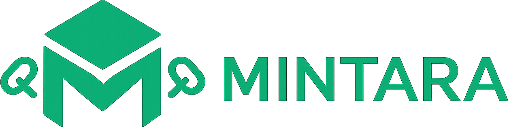
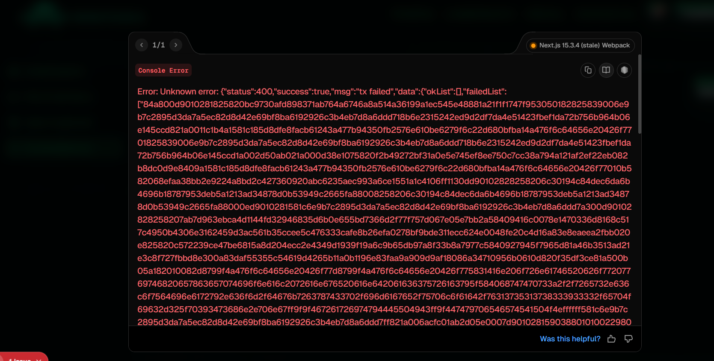

<div align="center">
  
</div>

[](https://nestjs.com/)
[](https://nextjs.org/)
[](https://godotengine.org/)
[](https://cardano.org/)
[](https://aiken-lang.org/)
[](https://meshjs.dev/)

## 🎥 Demo

Watch a demo of Mintara in action on YouTube:  
[https://youtu.be/230H7Mb3koU?si=Zi2uL07qUl7Uje9n](https://youtu.be/230H7Mb3koU?si=Zi2uL07qUl7Uje9n)

# 🧿 MINTARA

A fantasy-themed 2D dungeon crawler game with blockchain-powered NFT rewards on Cardano.

## 📋 Table of Contents

- [Overview](#overview)
- [Architecture](#architecture)
- [Components](#components)
  - [🎮 Game App](#-game-app)
  - [⚙️ Backend API](#️-backend-api)
  - [🌐 Frontend Web App](#-frontend-web-app)
  - [🔗 Smart Contract](#-smart-contract)
- [How It Works](#how-it-works)
- [Quick Start](#quick-start)
- [Development](#development)
- [Environment Variables](#environment-variables)
- [Contributing](#contributing)
- [License](#license)

## 🎯 Overview

Mintara is a complete gaming ecosystem that combines traditional 2D dungeon crawling gameplay with blockchain technology. Players can earn NFT rewards for their in-game achievements, which are minted on the Cardano blockchain using custom smart contracts.

## 🏗️ Architecture

```
┌─────────────┐    ┌─────────────┐    ┌─────────────┐
│   Game App  │    │   Frontend  │    │   Backend   │
│  (Godot)    │    │  (Next.js)  │    │  (NestJS)   │
└──────┬──────┘    └──────┬──────┘    └──────┬──────┘
       │                  │                  │
       └──────────────────┼──────────────────┘
                          │
                    ┌─────▼─────┐
                    │  Cardano  │
                    │ Blockchain│
                    │ (Aiken SC)│
                    └───────────┘
```

## 🧩 Components

### 🎮 Game App

**Location:** `game-app/`  
**Technology:** Godot Engine 4.3  
**Type:** 2D Dungeon Crawler

A fantasy-themed 2D dungeon crawler where players explore dungeons, fight enemies, and collect rewards. The game integrates with the backend to mint NFT rewards for player achievements.

**Key Features:**

- 2D dungeon exploration gameplay
- Action-based combat system
- NFT reward claiming system

**How to Play:**

1. Download and extract the repository.
2. Go to the `Builds/` folder.
3. Run `MINTARA.exe`.

> ⚠️ **Note:** To claim in-game rewards as NFTs, the backend server must be running.

> 🧑‍💻 **Player ID Requirement:** Before playing, open the frontend Mintara registration page, register an account, and obtain your Player ID. Paste this Player ID into the Main Menu of the game to enable NFT reward claiming.

### 🧠 Game Logic

- 🧱 Destroy crates to receive NFT-based rewards.
- 🔨 Only the hammer can destroy crates.
- 🧊 Different crates have different health; larger ones require multiple hits.
- 🐉 Slime enemies reduce your health if touched.
- 🗡️ Only the sword can kill slime enemies.
- 🧬 Slimes have different health; larger slimes need multiple sword hits.
- 💀 If you die, the game will automatically restart from the beginning.
- 🌊 Stepping into water will instantly kill you.
- ⚙️ Key bindings can be customized in the Settings menu.
- ❌ To quit the game, press ESC to return to the main menu, then press Quit Game.

### 🎮 Default Controls

| Action          | Key   |
| --------------- | ----- |
| Move Up         | W     |
| Move Down       | S     |
| Move Left       | A     |
| Move Right      | D     |
| Jump            | Space |
| Swing Sword     | C     |
| Swing Hammer    | Z     |
| Pause/Main Menu | ESC   |

You can always head back to the main menu during gameplay by pressing the ESC key.

### ⚙️ Backend API

**Location:** `backend/`  
**Technology:** NestJS (Node.js + TypeScript)  
**Database:** SQLite (development) / PostgreSQL (production)

A robust REST API that handles game logic, user authentication, and blockchain interactions. The backend serves as the bridge between the game client, frontend, and Cardano blockchain.

**Key Features:**

- User authentication and session management
- Game reward validation and processing
- NFT minting coordination with Cardano
- RESTful API endpoints
- Database management with Prisma ORM
- JWT-based authentication

**API Endpoints:**

- `/api/auth/*` - Authentication endpoints
- `/api/users/*` - User management
- `/api/rewards/*` - Reward and NFT operations
- `/api/mint/*` - Getting NFT metadata & more

### 🌐 Frontend Web App

**Location:** `frontend/`  
**Technology:** Next.js (React + TypeScript)  
**Styling:** Tailwind CSS + shadcn/ui
**Cardano Wallet Integration:** MeshJS

A modern web application that provides users with a comprehensive interface to manage their Mintara account, view NFT collections, and interact with the gaming ecosystem. MeshJS is used for seamless Cardano wallet integration and NFT operations.

**Key Features:**

- User dashboard and profile management
- NFT gallery and collection viewer
- Game statistics and achievements
- Responsive design for all devices
- Real-time updates and notifications
- **Cardano wallet connection and NFT minting via MeshJS**

### 🔗 Smart Contract

**Location:** `mint-policy/`  
**Technology:** Aiken (Cardano smart contract language)

A custom minting policy for NFTs on the Cardano blockchain that ensures secure and controlled NFT creation and destruction.

**Key Features:**

- **Minting:** Create new NFTs with metadata (only authorized minters)
- **Burning:** Destroy NFTs (only authorized burners)
- **Validation:** Ensures single NFT operations and valid metadata
- **Security:** Cryptographic signature verification

**Smart Contract Functions:**

- `validate_nft_mint()` - Validates NFT minting operations
- `validate_nft_burn()` - Validates NFT burning operations
- `validate_metadata()` - Ensures metadata meets requirements

## 🔄 How It Works

1. **Gameplay:** Players explore dungeons and complete objectives in the Godot game
2. **Achievement:** When a player destroys a crate, the game sends a random reward of random type claim to the user's account.
3. **Validation:** The backend validates the achievement and player eligibility
4. **Minting:** If valid, the backend interacts with the Cardano blockchain using the Aiken smart contract
5. **NFT Creation:** A new NFT is minted with game-specific metadata and sent to the player's wallet
6. **Display:** Players can view their NFT collection through the web frontend

## 🚀 Quick Start

1. **Create & register:** Navigate to the frontend web app and register by providing your Cardano wallet and credentials. Make sure your backend server is running.
2. **Find your user ID:** After logging in, your dashboard will display your unique user ID. You will need this for the game.
3. **Start the game:** When you open the game, it will prompt you for an ID—enter the user ID from your dashboard.

### Prerequisites

- Node.js 18+
- Cardano wallet (Eternl)
- MeshJS (for Cardano wallet integration)
- Godot Engine 4.3 (for game development only)
- **Make sure you have installed the [Eternl wallet browser extension for Chrome](https://chromewebstore.google.com/detail/eternl/kmhcihpebfmpgmihbkipmjlmmioameka)**

### 1. Clone the Repository

```bash
git clone <repository-url>
cd Mintara
```

### 2. Start the Backend

```bash
cd backend
npm install
npm run seed
npm run start:dev
```

The backend will be available at `http://localhost:3001`

### 3. Start the Frontend

```bash
cd frontend
npm install
npm run dev
```

The frontend will be available at `http://localhost:3000`

### 4. Play the Game

1. Navigate to `game-app/Builds/`
2. Run `MINTARA.exe`
3. Start playing and earn NFT rewards!

## 🔧 Environment Variables

### Backend (.env)

```env
DATABASE_URL="file:./dev.db"
PORT=3001
JWT_SECRET=your_jwt_secret_here
ACCESS_TOKEN_VALIDITY_DURATION_IN_SEC=100
REFRESH_TOKEN_SECRET=your_refresh_secret_here
ACCESS_TOKEN_SECRET=your_access_secret_here
REFRESH_TOKEN_VALIDITY_DURATION_IN_SEC=432000
NODE_ENV=development
POLICY_ID=your_cardano_policy_id
OWNER_PUB_KEY_HASH=your_owner_public_key_hash
```

Example .env for backend:

```
DATABASE_URL="file:./dev.db"
PORT=3001
JWT_SECRET=45ac78fa5c459c2c456a7390b26a8c0b
ACCESS_TOKEN_VALIDITY_DURATION_IN_SEC=100
REFRESH_TOKEN_SECRET=45ac78fa5c459c2c456a7390b26a8c0b
ACCESS_TOKEN_SECRET=45ac78fa5c459c2c456a7390b26a8c0b
REFRESH_TOKEN_VALIDITY_DURATION_IN_SEC=432000
NODE_ENV=development
POLICY_ID=08323bc27047645154898625f5aec2e95b04332af582ff59d74172f4
OWNER_PUB_KEY_HASH=636dab9ca312330eec5dd996e06bccb1ce4c3a8d113448a8c774fcd44a6352cc3e641cb26e1413c9dbee36adeee59aee949de087ad343db776f9dd9b3bbe3f00
```

### Frontend (.env.local)

```env
NEXT_PUBLIC_BACKEND_URL=http://localhost:3001/api/
NEXTAUTH_SECRET=your_nextauth_secret_here
NEXTAUTH_URL=http://localhost:3000
FRONTEND_URL=http://localhost:3000
```

Example .env for frontend:

```
NEXT_PUBLIC_BACKEND_URL = http://localhost:3001/api/
NEXTAUTH_SECRET="45ac78fa5c459c2c456a7390b26a8c0b"
NEXTAUTH_URL="http://localhost:3000"
FRONTEND_URL="http://localhost:3000"
```

## 🛡️ Custom Minting Policy Journey

During development, we created our own Cardano policy scripts to mint and burn NFTs. Despite trying several minimal and custom `nft_policy.ak` scripts, we encountered persistent errors (see example below). After nearly 3 days of troubleshooting, we decided to stick with our current approach.

<div align="center">
  
  <br/>
  <em>Example error encountered with custom policy scripts</em>
</div>

---

## 🤝 Contributing

1. Fork the repository
2. Create a feature branch (`git checkout -b feature/amazing-feature`)
3. Commit your changes (`git commit -m 'Add some amazing feature'`)
4. Push to the branch (`git push origin feature/amazing-feature`)
5. Open a Pull Request

### Development Guidelines

- Follow TypeScript best practices
- Write unit tests for new features
- Use conventional commit messages
- Ensure all components work together
- Test the complete flow from game to blockchain

## 📄 License

This project is licensed under the MIT License - see the [LICENSE](LICENSE) file for details.

## 🔗 Links

- [NestJS Documentation](https://nestjs.com/)
- [Next.js Documentation](https://nextjs.org/docs)
- [Godot Engine](https://godotengine.org/)
- [Cardano Documentation](https://docs.cardano.org/)
- [Aiken Language](https://aiken-lang.org/)

---

**Built with ❤️ for the Cardano community**
